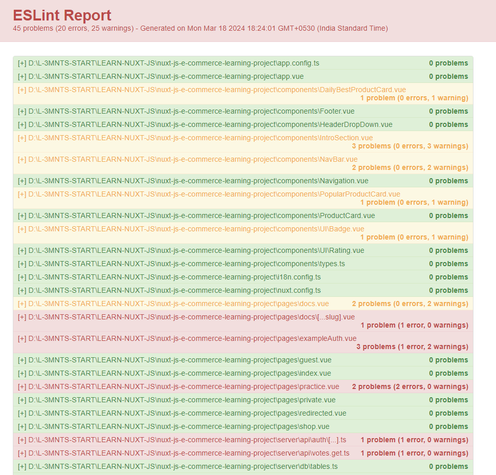

## Shareable ESLint Configurations for Javascript

[](https://www.npmjs.com/package/eslint-config-js-standards) [](https://www.npmjs.com/package/eslint-config-js-standards)

### Overview

This documentation provides developers with a step-by-step guide on integrating shareable ESLint configuration `eslint-config-js-standards` for javascript rules in any front-end project. ESLint is a static code analysis tool for identifying and fixing common programming errors and enforcing coding standards.

> <br/>
>
> ### The project is built and maintained by [Covalience, LLC.](https://covalience.com/)
>
> <br />

#### Installation

By running the following command, we are installing the latest version of eslint-config-js-standards and its dependencies:

```
 npm install --save-dev eslint  eslint-config-js-standards
```

#### Minimum dependencies version requirement:

The following are the minimum versions of the dependencies required to use `eslint-config-js-standards`:

1.  `eslint` >= 8.27.0

> <br/>
>
> :warning: If your project is using older versions of the above dependencies. Please check the older versions of this package and follow its documentation.
> <br/>

### Usage

Once the `eslint-config-js-standards` package is installed, you can use by specifying `eslint-config-js-standards` in the [`extends`](http://eslint.org/docs/user-guide/configuring#extending-configuration-files) section in your ESLint configuration.

1. Update **.eslintrc.{js,yml,json,cjs}** with the following:

```diff
extends:[
- 'eslint:recommended',
+ 'eslint-config-js-standards'
]

```

### ESLint Formatter (Optional)

ESLint comes with several built-in formatters to control the appearance of the linting results, and supports third-party formatters as well.
For more details, please refer to [here](https://eslint.org/docs/latest/use/formatters/).

Following are the steps to setup `html` eslint formatter.

1. Update `package.json` file with the following:

```diff
   scripts:{
+ "lint:format":"eslint . --format=html --output-file=eslintReport.html"
   }
```

2. Run `npm run lint:format` in the terminal. This will generate a HTML file named `eslintReport.html` at the root directory of your project and while opening it, it will show all eslint errors and warnings found.

_Example of ESLint Report in HTML:_



#### Additional Documentation

- [CHANGELOG](CHANGELOG.md)
- [Javascript Style Guide](./docs/JavaScriptStyleGuide.md)
